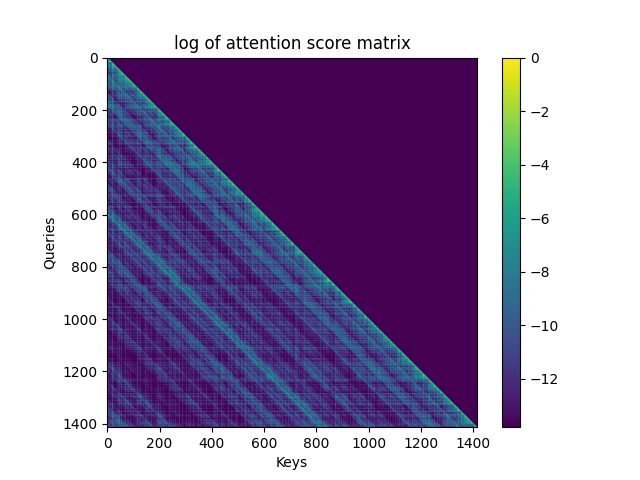

# Attention Saver

 <!-- Add a logo if desired -->

**Ultra-long sequence attention matrix and statistics extractor for HuggingFace LLMs.**

---

## ✨ Overview

Attention Saver lets you **extract entire attention matrices** or **row-wise statistics** (e.g. entropy) from any HuggingFace causal LLM layer—**even for 100,000+ tokens**—without running out of GPU memory.

- 🚀 **Scale**: Handles extraction of attention patterns for large context windows (100k+) (if your disk is big enough!)
- 🧑‍🔬 **Research-focused**: Plug in any row-wise statistic for per-row insights in attention patterns
- 🪄 **Simple API**: Just a context manager around your regular forward pass for any model
- 💾 **Efficient**: Saves to HDF5 on disk, not in RAM

---

## Installation

```bash
pip install git+https://github.com/MathisPink/attention_saver.git

or clone and install locally:

git clone https://github.com/MathisPink/attention_saver.git
cd attention_saver
pip install .
```

## Usage Example
```python
import numpy as np
from transformers import AutoModelForCausalLM, AutoTokenizer
import torch
from attention_saver import AttentionSaver

model_name = "meta-llama/Llama-3.2-1B"
tokenizer = AutoTokenizer.from_pretrained(model_name)
model = AutoModelForCausalLM.from_pretrained(model_name, attn_implementation="sdpa").to("cuda")

text = "The attention matrix will be huge! " * 10000  # About 60k tokens
inputs = tokenizer(text, return_tensors="pt").to(model.device)

with AttentionSaver(
    model=model,
    layer_ids=[4, 5, 6],
    output_file="attention_matrices.h5",
    compute_softmax=True,
    dtype="float16",
    save_statistic_only=False,  # Set True to save only the below statistics of each attention row
    row_wise_statistics=[
        lambda p: -np.sum(p * np.log2(p + 1e-9)),  # entropy
        lambda p: np.sum(np.abs(p - 1.0 / len(p))), # L1 distance from uniform
    ],
    verbose=True,
):
    model(**inputs)
```

## Visualizing Results

```python
import h5py
import matplotlib.pyplot as plt
import numpy as np

with h5py.File("attention_matrices.h5", "r") as f:
    arr = f["layer_5/batch_0/head_0"][:]
    plt.figure(figsize=(10,8))
    plt.imshow(np.log(arr + 1e-20), aspect='auto')
    plt.colorbar()
    plt.title("Attention Matrix (log scale)")
    plt.show()
```

<div align="center">   </div>

## FAQ

    **Q: Can I run this on any HuggingFace causal LLM?**
    **A**: Yes, as long as your model implements the standard HuggingFace attention interface.

    **Q: Can I save multiple statistics at once?**
    **A**: Yes, pass a list of callables. Each one will be saved as a separate column in the output HDF5 dataset.

    **Q: Is there a CLI?**
    **A**: No, but you can run the examples in Python or adapt the code in a notebook.

    **Q: Does this work with FlashAttention2?**
    **A**: Yes! This is agnostic to the attention implementation used by the model.

## License

Apache 2.0

## Citation
```bibtex
@software{Pink2025attentionsaver,
  author = {Mathis Pink},
  title = {Attention Saver: Extracting ultra-long context attention matrices for HuggingFace LLMs},
  year = {2025},
  url = {https://github.com/MathisPink/attention_saver},
}
```

